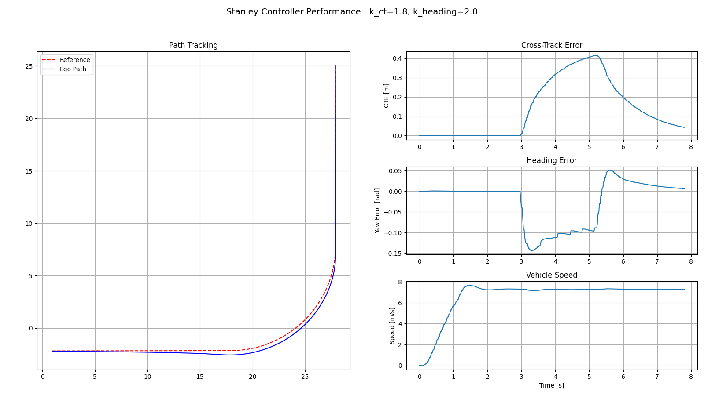

# CARLA + ROS 2 Control Stack  
**Stanley vs LQR Lateral Control with Service-Based Trajectory Generation**

---

## Overview

This repository implements a **ROS 2–based autonomous vehicle control pipeline** evaluated in the **CARLA simulator**.
The project focuses on **trajectory generation, coordinate frame transformation, and lateral control performance**
using two fundamentally different controllers:

- **Stanley controller** (geometric, error-based)
- **LQR controller** (model-based, dynamic bicycle formulation)

The emphasis is on *understanding controller behavior and modeling assumptions*, not perception or end-to-end autonomy.

---

## System Architecture

```
CARLA Simulator
      ↓
carla_ros_bridge
      ↓
Trajectory Generation Service (GenerateTrajectory.srv)
      ↓
Global Trajectory (World Frame)
      ↓
World → Ego Frame Transformation
      ↓
Lateral / Longitudinal Control
      ↓
CARLA Vehicle Actuation
      ↓
Logged Data → Offline Plotting
```

A key design choice is the use of a **ROS 2 service** for trajectory generation.
Once generated, the trajectory remains fixed, avoiding unnecessary topic traffic and keeping the control loop deterministic.

---

## Workspace & Package Structure

```
src/
├── carla_control/
│   ├── trajectory_service.py     # Trajectory generation (ROS 2 service)
│   ├── stanley_controller.py     # Stanley lateral controller
│   ├── lqr_controller.py         # Dynamic bicycle LQR controller
│   ├── traj_plot.py              # Offline plotting utilities
│   └── carla_demo1.py
│
└── carla_control_interfaces/
    └── srv/
        └── GenerateTrajectory.srv
```

---

## Trajectory Generation

- Trajectories are generated using a **ROS 2 service**
- Supported trajectory types include:
  - Straight
  - Right turn (circular arc)
  - S-curve
- The trajectory is returned in the **world frame**
- Discrete curvature is computed as:

```
κ = d(yaw) / ds
```

Curvature is later reused for **feedforward steering** in the LQR controller.

---

## Frame Transformation

- The received trajectory is transformed from the **world frame** into the **ego vehicle frame**
- Transformation uses the current ego pose from CARLA
- Controllers operate exclusively in the ego frame, which improves stability and interpretability

---

## Controllers

### Stanley Controller

- Geometric, error-based controller
- Uses:
  - Cross-track error (CTE)
  - Heading error
- Reactive in nature
- Robust and simple to tune
- Performance degrades at:
  - High speeds
  - Tight curvature
  - Rapid curvature transitions

---

### LQR Controller

- Model-based optimal state-feedback controller
- Based on a **linear dynamic bicycle model**
- State vector includes:
  - Lateral error
  - Lateral velocity
  - Heading error
  - Yaw rate
- Control structure:
  - **Feedforward**: curvature-based steady-state steering
  - **Feedback**: LQR stabilization and damping
- Gains are recomputed when vehicle speed changes significantly
- Low-speed gating is applied to avoid singularities

---

## LQR vs Stanley — Key Comparison

| Aspect | Stanley | LQR |
|------|--------|-----|
| Control philosophy | Geometric | Model-based |
| Vehicle dynamics | ❌ | ✅ |
| Feedforward action | ❌ | ✅ |
| High-speed behavior | Limited | Stable |
| Sensitivity to modeling | Low | High |
| Interpretability | High | High (with model) |

**Key insight:**  
LQR performance improvements come from **correct modeling and feedforward–feedback separation**, not simply more aggressive gains.

---

## Build Instructions

```bash
cd ~/carla_control_ws
colcon build
source install/setup.bash
```

Ensure:
- CARLA simulator is running
- `carla_ros_bridge` is active

---

## Runtime Procedure

### 1. Start Trajectory Service

```bash
ros2 run carla_control trajectory_service
```

---

### 2. Run Stanley Controller

```bash
ros2 run carla_control stanley_controller   --ros-args   -p trajectory_type:=right_turn   -p waypoint_spacing:=0.08   -p total_length:=50.0   -p v_ref:=8.0   -p turn_radius:=5.0
```

**Stanley tracking plot:**  
**

---

### 3. Run LQR Controller

```bash
ros2 run carla_control lqr_controller   --ros-args   -p trajectory_type:=right_turn   -p waypoint_spacing:=0.08   -p total_length:=110.0   -p v_ref:=30.0   -p turn_radius:=10.0
```

**LQR tracking plot:**  
**

---

## Logging & Analysis

Both controllers log:
- Cross-track error
- Heading error
- Steering commands
- Vehicle states

to generate performance plots.

---

## Scope & Assumptions

- Ground-truth state feedback
- Ideal actuation
- No perception or localization noise

These experiments establish a **clean baseline** for controller behavior.

---

## Future Work

- Introduce estimation uncertainty and sensor noise
- Study robustness under degraded state feedback
- Extend to dynamic replanning scenarios
- Integrate perception and localization pipelines

---

## Motivation

This project was built to understand **why controllers behave the way they do**, not just how to implement them.
The focus is on **modeling correctness, control structure, and system-level reasoning**.
